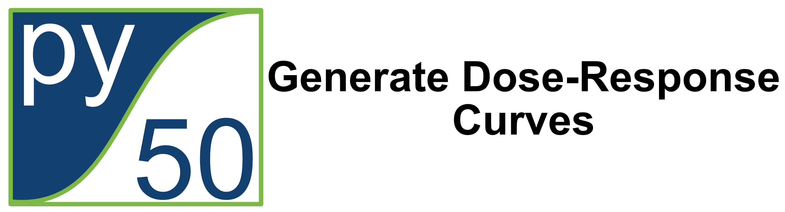

# py50-streamlit

# py50: Generate Dose-Response Curves

 

## Summary

The py50-streamlit application can be found here: https://py50-app.streamlit.app 

The aim of this repository is to make py50 more accessible to those who may not be comfortable with coding.
As such, py50 has been converted into a Streamlit web application.Many of the same functions have been ported
over to the application. 

For anyone interested with the specifics of the py50 code, the repository can be found here.

**NOTE:** It takes more time for me to update the py50-streamlit. As such, more features and updates will be implemented 
with the Python bindings before the web application. For those interested with updates and features, please follow the 
main py50 repository [here](https://github.com/tlint101/py50).

## Future Work
Additional features are being implemented for the upcoming py50 v1.0.0 release. My current "To-Do" for the py50-streamlit
will be as follows:

- [X] Update py50 Streamlit to version 1.0.0
- [ ] Refactor code for application maintainability

## Citation
If you are interested in citing the file, I have generated a DOI link for the main py50 repository using Zenodo here: 

Thanks for your interest! 